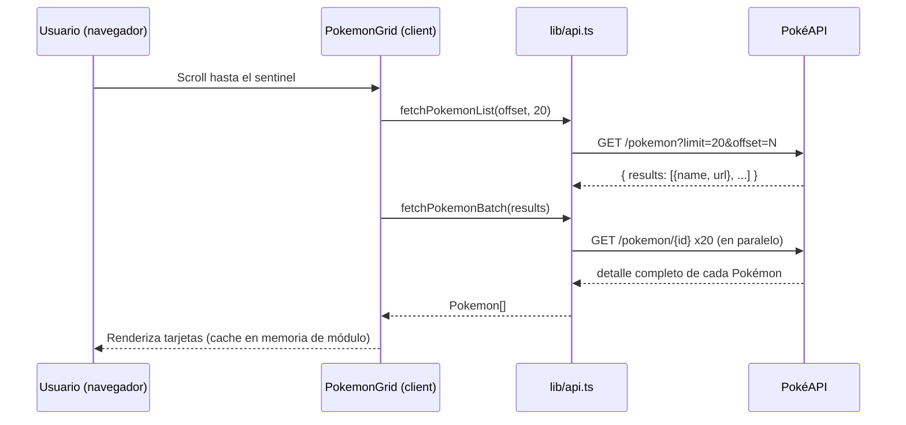
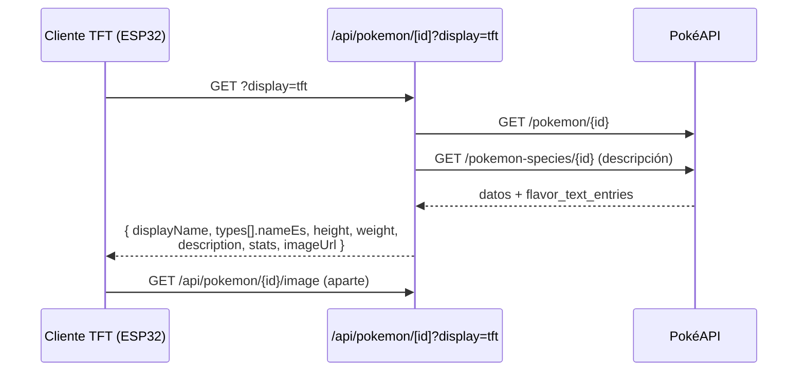
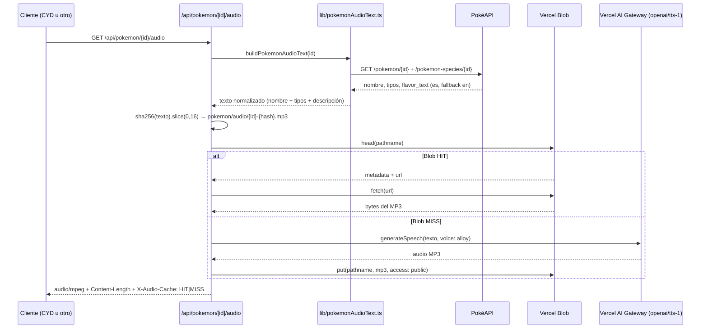

# Arquitectura

> Excluye completamente `arduino/` (firmware de la CYD). Este documento
> describe solo el proyecto Next.js.

## Next.js y App Router

El proyecto usa el **App Router** de Next.js 16. No hay Pages Router, no
hay `getServerSideProps`/`getStaticProps` clásicos: todo pasa por
`app/`, Route Handlers (`route.js`) y componentes de cliente marcados con
`'use client'`.

No hay backend propio ni base de datos: cada request a la app o a la API
termina, directa o indirectamente, en una llamada a PokéAPI en el momento.
No hay build-time fetching ni ISR configurado.

## Estructura de carpetas relevante

```
app/
  page.tsx                    # Home — grid (client component)
  layout.tsx                  # Root layout: fuentes, metadata PWA, tema
  globals.css
  pokemon/[id]/page.tsx       # Detalle de un Pokémon (client component)
  api/
    pokemon/[id]/route.js         # JSON base + modo ?display=tft + bitmap
    pokemon/[id]/image/route.js   # JPEG 160x160 para TFT
    pokemon/[id]/audio/route.js   # MP3 TTS cacheado en Blob
    audio-test/route.js           # MP3 estático de prueba
    audio-test/wav/route.js       # WAV generado, tono de prueba (DAC)

components/                   # UI, todos client components salvo excepciones triviales
  PokedexFrame.tsx            # Marco visual "Pokédex roja"
  PokemonGrid.tsx             # Scroll infinito + cache en memoria de módulo
  PokemonCard.tsx
  EvolutionChain.tsx
  StatBar.tsx
  TypeBadge.tsx / TypeIcon.tsx
  PokeballLoader.tsx

lib/
  api.ts                 # Fetch a PokéAPI (lista, detalle, species, evolución) + helpers
  pokemonAudioText.ts     # Arma el texto hablado para /api/pokemon/[id]/audio
  spriteBitmap.js         # Conversión sprite -> bitmap 1bpp (algoritmo standalone)
  typeColors.ts           # Colores por tipo (hex) para la UI
  typeNames.ts            # Nombres de tipo en español (TYPE_NAMES_ES)
  types.ts                # Tipos TS de las respuestas de PokéAPI
  usePokemonSound.ts      # Hook client-side: Web Speech API (narración en la web)

assets/audio/pokedesk-test.mp3   # MP3 fijo servido por /api/audio-test
public/                          # Manifest PWA, íconos, SVGs de create-next-app sin usar
```

### Separación cliente / servidor / API / utilidades / assets

- **Servidor (Route Handlers, `runtime = "nodejs"`)**: los 5 archivos bajo
  `app/api/**/route.js`. Corren en Node.js (no Edge) porque `sharp`,
  `fs` y `crypto` lo requieren. No usan ningún framework de datos
  (Prisma, ORM, etc.) — hacen `fetch` directo a PokéAPI y devuelven
  `Response.json(...)` o un `Response` binario.
- **Cliente**: `app/page.tsx`, `app/pokemon/[id]/page.tsx` y casi todos
  los `components/*` están marcados `'use client'` porque manejan estado,
  efectos, `IntersectionObserver` o `speechSynthesis`. `PokedexFrame.tsx`
  y `TypeBadge.tsx` no necesitan estado y podrían ser server components,
  pero al estar anidados dentro de árboles cliente su ejecución real es
  igualmente client-side.
- **Utilidades (`lib/`)**: sin código React. `api.ts` y `pokemonAudioText.ts`
  llaman a PokéAPI de forma independiente (ver duplicación señalada en
  [`development-notes.md`](development-notes.md)). `spriteBitmap.js` es
  puro procesamiento de imagen, sin dependencias de Next.js, reusable en
  cualquier runtime Node.
- **Assets estáticos**: `public/` (manifest, íconos, SVGs) servidos
  directo por Next.js; `assets/audio/pokedesk-test.mp3` **no** está en
  `public/` a propósito — se empaqueta explícitamente en la función
  serverless vía `outputFileTracingIncludes` en `next.config.ts` (ver
  más abajo) y se lee con `fs.readFileSync` desde
  `app/api/audio-test/route.js`.

## Flujo: página → PokéAPI (web)



En el detalle (`app/pokemon/[id]/page.tsx`) se agrega un segundo fetch a
`species.url` (descripción + cadena de evolución) una vez que el Pokémon
base cargó, con fallo silencioso si PokéAPI no responde.

## Flujo específico para TFT



El mismo `route.js` de `/api/pokemon/[id]`, **sin** `?display=tft`, sirve
además el modo bitmap: `{ name, type, bitmap? }`, con `bitmap` construido
por `lib/spriteBitmap.js` a partir del sprite pixel-art
(`sprites.front_default`), pensado para un display monocromo tipo OLED
(no confirmado si la CYD actual lo usa — ver
[`development-notes.md`](development-notes.md)).

## Flujo de imágenes

Hay **tres** fuentes de imagen distintas según el contexto, sin relación
entre sí:

1. **Web (grid y detalle)**: `sprites.other['official-artwork'].front_default`
   de PokéAPI, renderizado con `next/image` pero con `unoptimized: true`
   (ver decisión más abajo).
2. **Web (cadena de evolución)**: sprites pixel-art servidos directo desde
   el repo público `PokeAPI/sprites` en GitHub
   (`raw.githubusercontent.com/.../sprites/pokemon/{id}.png`), no desde
   PokéAPI ni procesados.
3. **TFT (`/api/pokemon/[id]/image`)**: toma el mismo official-artwork,
   lo descarga server-side y lo reprocesa con `sharp`: resize a 160x160
   `fit: "contain"`, aplanado sobre fondo blanco (elimina alpha) y
   recodificado como JPEG calidad 82. Pensado para que un ESP32 no tenga
   que decodificar PNG con canal alfa.
4. **TFT (bitmap opcional)**: `lib/spriteBitmap.js` toma
   `sprites.front_default` (sprite chico, no el artwork) y lo convierte a
   un bitmap monocromo 1bpp empaquetado en base64, formato
   `adafruit_gfx_1bpp`.

## Flujo de audio TTS



Nota: `usePokemonSound.ts` (hook cliente) es un **camino totalmente
separado** que no pasa por este endpoint ni por el AI Gateway — usa la
`SpeechSynthesisUtterance` nativa del navegador para narrar nombre, tipo y
descripción en la página de detalle. Comparten la idea (texto hablado)
pero no comparten código ni infraestructura.

## Caché de audios en Vercel Blob

- Clave de caché: hash sha256 (16 hex) del **texto final normalizado**,
  no del id del Pokémon. Si la descripción elegida cambia (por ejemplo
  PokéAPI actualiza `flavor_text_entries`), se genera un blob nuevo con
  otro pathname en vez de reusar uno viejo.
- `access: "public"`, `addRandomSuffix: false`, `allowOverwrite: true` —
  el pathname es determinístico y sirve como idempotencia natural.
- Un fallo al escribir en Blob no rompe la respuesta: el MP3 recién
  generado se devuelve igual, solo que se va a regenerar en el próximo
  pedido también.
- Detalle de costos/limitaciones en [`docs/api.md`](api.md) y
  [`docs/development-notes.md`](development-notes.md).

## Decisiones sobre renderizado y procesamiento de imágenes

- **`images.unoptimized: true`** en `next.config.ts`: la app no usa el
  optimizador de imágenes de Next/Vercel para las imágenes de PokéAPI ni
  de GitHub — se sirven tal cual. Evita configurar `remotePatterns` para
  múltiples hosts externos y el costo de optimización on-demand.
- **`serverExternalPackages: ["sharp"]`**: mantiene `sharp` sin bundlear,
  para que el tracing automático de dependencias de Vercel
  (`@vercel/nft`) pueda resolver correctamente su grafo de
  require/import.
- **`outputFileTracingIncludes`**: fuerza explícitamente en el bundle de
  las funciones `/api/pokemon/**` los binarios nativos de `sharp` para
  Linux x64 (`@img/sharp-linux-x64`, `@img/sharp-libvips-linux-x64`),
  porque el binding nativo se carga con `dlopen()` en tiempo de
  ejecución y el tracing estático no lo detecta (causaba
  `ERR_DLOPEN_FAILED` en producción). También fuerza
  `assets/audio/**` en el bundle de `/api/audio-test/**` porque ese
  archivo no vive en `public/` y no hay ningún `require`/`import`
  estático que el tracer pueda seguir hasta él (se lee con
  `fs.readFileSync` en runtime).
- **Carga perezosa y defensiva de `sharp`**: tanto `image/route.js` como
  `spriteBitmap.js` cargan `sharp` con `import()` dinámico dentro de
  `loadSharp()`, con try/catch — si `sharp` no está disponible en algún
  entorno, el endpoint de imagen responde 500 controlado y el bitmap
  opcional en `/api/pokemon/[id]` simplemente se omite del JSON en vez
  de tirar abajo toda la respuesta.

## Relaciones entre módulos

- `app/api/pokemon/[id]/route.js` y `lib/pokemonAudioText.ts` **no
  comparten código** para obtener nombre/tipos/descripción, aunque
  hacen esencialmente lo mismo contra PokéAPI — es intencional, para no
  tocar el endpoint existente al agregar audio (ver
  [`development-notes.md`](development-notes.md)).
- `lib/typeNames.ts` (`TYPE_NAMES_ES`) es compartido por el endpoint TFT,
  `lib/pokemonAudioText.ts` y la UI web (`app/pokemon/[id]/page.tsx`,
  `usePokemonSound.ts`) — única fuente de verdad para nombres de tipo en
  español.
- `lib/api.ts` es usado solo por componentes cliente (grid, detalle,
  evolución); ningún Route Handler lo importa.
- `lib/spriteBitmap.js` es usado únicamente por
  `app/api/pokemon/[id]/route.js`.

## Dependencias externas importantes

| Dependencia | Uso |
| --- | --- |
| `pokeapi.co` | Única fuente de datos de Pokémon (sin auth) |
| `raw.githubusercontent.com/PokeAPI/sprites` | Sprites pixel-art para la cadena de evolución |
| `sharp` | Procesamiento de imágenes server-side (JPEG TFT, bitmap 1bpp) |
| `ai` (Vercel AI SDK) + Vercel AI Gateway | Generación de voz (`openai/tts-1`) |
| `@vercel/blob` | Caché persistente de los MP3 generados |
| `next-pwa` | Instalado como dependencia pero **no está configurado** en `next.config.ts` actualmente — ver [`development-notes.md`](development-notes.md) |
